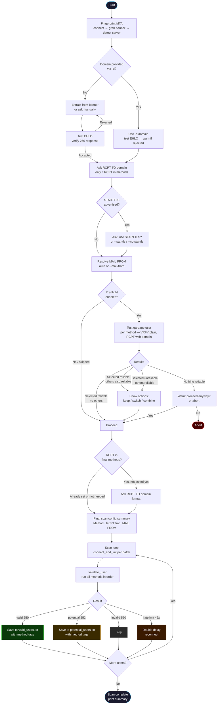

# SMTPwn — SMTP User Enumeration Tool for Penetration Testing

> [Github Repository](https://github.com/marcabounader/SMTPwn) — by Marc Abou Nader

```
  ____  __  __ _____ ____
 / ___||  \/  |_   _|  _ \__      ___ __
 \___ \| |\/| | | | | |_) \ \ /\ / / '_ \
  ___) | |  | | | | |  __/ \ V  V /| | | |
 |____/|_|  |_| |_| |_|     \_/\_/ |_| |_|

  SMTP User Enumerator  |  by Marc Abou Nader
```

> SMTP user enumeration tool for penetration testers, bug bounty hunters, and security researchers.  
> MTA-aware. Rate-limit resilient. Catch-all resistant.


---

Demo


> Watch SMTPwn in action: MTA fingerprinting, pre-flight checks, and live SMTP user enumeration.

---

## What is it?

SMTPwn is a Python-based SMTP user enumeration tool that abuses the SMTP protocol to discover valid usernames on a mail server — a classic recon technique that still works on a surprising number of real-world targets.

It supports three native SMTP enumeration methods (`VRFY`, `RCPT TO`, `EXPN`) in any combination. It fingerprints the target MTA, auto-selects the most reliable method, handles catch-all configs, detects rate limiting, supports STARTTLS and AUTH, and saves results in txt, JSON, or CSV format.

Useful for: OSCP exam prep, HackTheBox machines, TryHackMe labs, CTF challenges, and real-world email security assessments.

Tested against: Postfix, Sendmail, Microsoft Exchange, Exim, HMailServer, Zimbra, qmail.

---

## Workflow



---

## Features

- MTA fingerprinting — detects Postfix, Exchange, Exim, Sendmail, Zimbra, qmail and more from the banner, auto-selects the best method and warns about disabled commands
- 3 enumeration methods — `VRFY`, `RCPT`, `EXPN`, usable solo or in any combination (user must pass all specified methods)
- Smart pre-flight — tests all methods with a random garbage user, shows reliability per method, suggests switching if yours is unreliable
- Catch-all detection — pre-flight identifies catch-all and open relay configs before wasting time scanning
- EHLO validation — tests EHLO domain before scanning, retries if rejected
- STARTTLS support — auto-detects and upgrades to TLS, asks interactively if not forced
- SMTP AUTH — supports AUTH LOGIN for port 587/465 targets
- Rate limit detection — detects 421/450/451/452 responses, auto-increases delay, gradually recovers
- Timing templates T0–T5 — modeled after Nmap, controls delay/timeout/batch together
- Custom MAIL FROM — set a believable sender identity, auto-set based on RCPT domain
- Username variations — generate common formats from a full name (`john.doe`, `jdoe`, `j.doe`, etc.)
- Resume/checkpoint — saves progress, resume interrupted scans with `--resume`
- Separate output files — confirmed valid (250) and potential (252) users saved to different files
- Method tags in output — multi-method results tagged per method (`[RCPT:valid | VRFY:potential]`)
- Output formats — txt, JSON, CSV
- EXPN expansion — parses and saves expanded mailing list addresses
- Domain-aware — separates EHLO domain from RCPT TO domain, each configurable independently

---

## Installation

```bash
git clone https://github.com/marcabounader/SMTPwn.git
cd SMTPwn
# No external dependencies — pure Python stdlib
python3 SMTPawn.py --help
```

---

## Usage

```
python3 SMTPawn.py -t <TARGET> [options]
```

### Options

| Flag | Description | Default |
|------|-------------|---------|
| `-t`, `--target` | Target IP or hostname | *(required)* |
| `-p`, `--port` | SMTP port | `25` |
| `-d`, `--domain` | Domain for EHLO. If omitted, extracted from banner | — |
| `-w`, `--wordlist` | Path to username wordlist | — |
| `-u`, `--user` | Test a single username | — |
| `--name` | Generate username variations from a full name (e.g. `"John Doe"`) | — |
| `-m`, `--method` | Enumeration method(s), comma-separated: `VRFY`, `RCPT`, `EXPN` | `RCPT` |
| `--mail-from` | Custom MAIL FROM address | auto from domain |
| `-T`, `--timing` | Timing template T0–T5 (see below) | `T3` |
| `-o`, `--output` | Output file for confirmed valid users | `valid_users.txt` |
| `--output-format` | Output format: `txt`, `json`, `csv` | `txt` |
| `--resume` | Resume from checkpoint after interrupted scan | off |
| `--starttls` | Force STARTTLS upgrade after EHLO | off |
| `--no-starttls` | Never use STARTTLS even if server advertises it | off |
| `--auth-user` | SMTP AUTH username (for port 587/465) | — |
| `--auth-pass` | SMTP AUTH password (for port 587/465) | — |
| `-b`, `--batch` | Usernames per TCP connection | set by `-T` |
| `--delay` | Delay between queries in seconds | set by `-T` |
| `--timeout` | Socket timeout in seconds | set by `-T` |
| `--rcpt-domain` | Domain for RCPT TO. Use `none` for plain username | interactive |
| `--force` | Skip all confirmation prompts — proceed even if EHLO fails or method is unreliable | off |
| `--no-method-switch` | Never suggest switching methods after pre-flight | off |
| `--threads` | Number of parallel threads | `1` |
| `--no-preflight` | Skip pre-flight check entirely | off |
| `--preflight-mode` | Pre-flight scope: `selected` or `all` | `all` |
| `-v`, `--verbose` | Show raw SMTP traffic per command | off |

---

## Timing Templates

Modeled after Nmap's `-T` flag. Controls delay, timeout, and batch size together.

| Template | Delay | Timeout | Batch | Use case |
|----------|-------|---------|-------|----------|
| `T0` Paranoid | 5.0s | 30s | 1 | Maximum stealth, IDS evasion |
| `T1` Sneaky | 2.0s | 20s | 2 | Slow and stealthy |
| `T2` Polite | 1.0s | 15s | 5 | Reduced server load |
| `T3` Normal | 0.3s | 15s | 10 | **Default** — balanced |
| `T4` Aggressive | 0.1s | 10s | 20 | Fast, CTF/lab targets |
| `T5` Insane | 0s | 5s | 50 | Maximum speed, very noisy |

Batch controls users per TCP connection per thread. With `--threads N`, effective concurrency = `batch × threads`. For example `-T3 --threads 3` processes up to 30 users simultaneously across 3 connections.

You can override individual values on top of a template — e.g. `-T4 --delay 0.5` uses T4 settings but with a 0.5s delay.

> The tool warns automatically when `threads × batch ≥ 50` as this is likely to trigger rate limiting on strict servers.

---

## Defaults

| Setting | Default | Notes |
|---------|---------|-------|
| Port | `25` | Use `587` or `465` for submission ports |
| Method | `RCPT` | Auto-adjusted based on MTA fingerprint if `-m` not set |
| Timing | `T3 Normal` | Balanced speed and stealth |
| MAIL FROM | auto from domain | Changes based on RCPT domain choice |
| Output | `valid_users.txt` | All results — valid and potential, tagged with status and method |
| Output format | `txt` | Plain text, one user per line |
| Pre-flight | enabled, all methods | Asked interactively if not set via flag |
| STARTTLS | auto-detected, asks interactively | Use `--starttls` to force, `--no-starttls` to skip |
| Batch | `10` (T3) | Users per TCP connection |
| Delay | `0.3s` (T3) | Between each query, auto-increases on rate limit |
| Timeout | `15s` (T3) | Per socket operation |
| Checkpoint | every 10 users | Auto-saved, use `--resume` to continue |
| Threads | `1` | Use `--threads N` for parallel scanning. Higher = faster but noisier |

---

## Examples

Basic scan — auto-extract domain, RCPT method, T3 timing:
```bash
python3 SMTPawn.py -t 10.10.10.10 -w users.txt
```

Specify domain explicitly:
```bash
python3 SMTPawn.py -t 10.10.10.10 -d target.com -w users.txt
```

Single user check with full SMTP traffic:
```bash
python3 SMTPawn.py -t 10.10.10.10 -d target.com -u admin -v
```

Use VRFY method:
```bash
python3 SMTPawn.py -t 10.10.10.10 -d target.com -w users.txt -m VRFY
```

Combine methods — user must pass both VRFY and RCPT:
```bash
python3 SMTPawn.py -t 10.10.10.10 -d target.com -w users.txt -m VRFY,RCPT
```

Use all three methods:
```bash
python3 SMTPawn.py -t 10.10.10.10 -d target.com -w users.txt -m VRFY,RCPT,EXPN
```

Generate username variations from a full name:
```bash
python3 SMTPawn.py -t 10.10.10.10 -d target.com --name "John Doe"
```

Stealthy scan — T1 timing, custom MAIL FROM:
```bash
python3 SMTPawn.py -t 10.10.10.10 -d target.com -w users.txt -T1 --mail-from support@target.com
```

Fast scan on a lab target:
```bash
python3 SMTPawn.py -t 10.10.10.10 -d target.com -w users.txt -T4
```

STARTTLS with AUTH on port 587:
```bash
python3 SMTPawn.py -t 10.10.10.10 -p 587 -d target.com -w users.txt --starttls --auth-user user@target.com --auth-pass password
```

Output results as JSON:
```bash
python3 SMTPawn.py -t 10.10.10.10 -d target.com -w users.txt --output-format json
```

Resume an interrupted scan:
```bash
python3 SMTPawn.py -t 10.10.10.10 -d target.com -w users.txt --resume
```

Skip pre-flight entirely:
```bash
python3 SMTPawn.py -t 10.10.10.10 -d target.com -w users.txt --no-preflight
```

Pre-flight on selected method only:
```bash
python3 SMTPawn.py -t 10.10.10.10 -d target.com -w users.txt -m VRFY --preflight-mode selected
```

Multithreaded scan:
```bash
python3 SMTPawn.py -t 10.10.10.10 -w users.txt --threads 5
```

---

## Method Guide

| Method | How it works | Best used when |
|--------|-------------|----------------|
| `VRFY` | Sends `VRFY <user>` — server confirms if user exists | Sendmail, HMailServer. Often disabled on modern configs |
| `RCPT` | `MAIL FROM` + `RCPT TO` — checks delivery acceptance | Most reliable. Works on almost all server types |
| `EXPN` | Sends `EXPN <user>` — expands mailing lists/aliases | Legacy Sendmail configs. Returns expanded addresses |
| `VRFY,RCPT` | User must pass both | Catch-all environments — reduces false positives |
| `EXPN,RCPT` | User must pass both | Catch-all environments — reduces false positives |
| `EXPN,VRFY` | User must pass both | Catch-all environments — reduces false positives |
| `VRFY,RCPT,EXPN` | User must pass all three | Maximum confidence, minimum false positives |

---

## MTA Behavior Reference

Different mail servers handle enumeration commands differently. SMTPwn fingerprints the target and adjusts behavior automatically.

| MTA | VRFY | EXPN | Best Method | Notes |
|-----|------|------|-------------|-------|
| Postfix | 252 for most users | Disabled | RCPT | Watch for catch-all. Plain username often works |
| Sendmail | Usually works | Often enabled | VRFY | Older configs very open to enumeration |
| Exchange | Disabled | Disabled | RCPT | Requires `user@domain` format. 550 5.7.1 = user may exist |
| Exim | Sometimes 252 | Disabled | RCPT | Requires `user@domain` format |
| Zimbra | Varies | Disabled | RCPT | Similar to Postfix behavior |
| HMailServer | Reliable 250/550 | Disabled | VRFY | Very clean responses |
| qmail | Rarely works | Disabled | RCPT | Strict. Requires `user@domain` |

---

## How Pre-flight Works

Before scanning, SMTPwn connects and tests a random garbage username through all methods (or your selected method). It then shows a reliability table and lets you choose:

```
[*] Pre-flight results:
    VRFY   : ✓ reliable  ◄ selected
    RCPT   : ✓ reliable
    EXPN   : ✗ disabled / not supported

[+] Selected method(s) VRFY look reliable.
[*] Other reliable method(s) also found: RCPT
    [1] Keep VRFY (current)
    [2] RCPT only
    [3] RCPT,VRFY — must pass all
[?] Choose (default: 1):
```

If no reliable method exists, it warns you and asks whether to proceed anyway.

---

## Sample Output

```
[*] Timing   : T3 Normal — delay=0.3s  timeout=15.0s  batch=10
[*] Fingerprinting target …
[*] MTA detected : Postfix
[*] Banner       : 220 mail.target.com ESMTP Postfix

[*] Domain found in banner: mail.target.com
[?] Use 'mail.target.com' for EHLO? [y/n] (default: y): y
[+] EHLO accepted — server responded 250

[*] STARTTLS : not advertised

[*] Pre-flight results:
    VRFY   : ~ ambiguous (252)
    RCPT   : ✓ reliable  ◄ selected
    EXPN   : ✗ disabled / not supported

[+] Selected method(s) RCPT look reliable — proceeding.

[*] ── Scan configuration ──────────────────────────
[*] Method(s) : RCPT
[*] RCPT fmt  : user@mail.target.com
[*] MAIL FROM : noreply@mail.target.com (auto)
[*] ────────────────────────────────────────────────

[1/1542] [-]   INVALID   : aaron
[2/1542] [-]   INVALID   : adam
[3/1542] [+++] VALID     : admin
[4/1542] [?]   POTENTIAL : backup (VRFY returned 252)
...
[*] Scan complete.
[*] Valid     : 3
[*] Potential : 1
[*] Results saved to: valid_users.txt
```

---

## Recommended Wordlists

- `/usr/share/seclists/Usernames/top-usernames-shortlist.txt`
- `/usr/share/seclists/Usernames/Names/names.txt`
- `/usr/share/wordlists/metasploit/unix_users.txt`

---

## Tags

`smtp-enumeration` `smtp-user-enum` `pentesting` `recon` `oscp` `ctf` `bugbounty` `email-security` `vrfy` `rcpt` `expn` `smtp-relay` `kali-linux` `hackthebox` `tryhackme` `python` `network-security` `starttls` `mta-fingerprinting`

---

## Disclaimer

> SMTPwn is intended for authorized penetration testing and educational use only.  
> Running this tool against systems you do not have explicit written permission to test is **illegal**.  
> The author is not responsible for any misuse or damage caused by this tool.  
> Use it on your own lab, CTF environments, or with a signed scope of work.

---

## License

MIT — do whatever you want, don't blame me.

---

> Source code & releases: [github.com/marcabounader/SMTPwn](https://github.com/marcabounader/SMTPwn)
